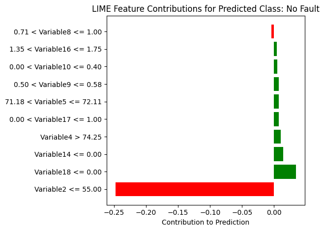
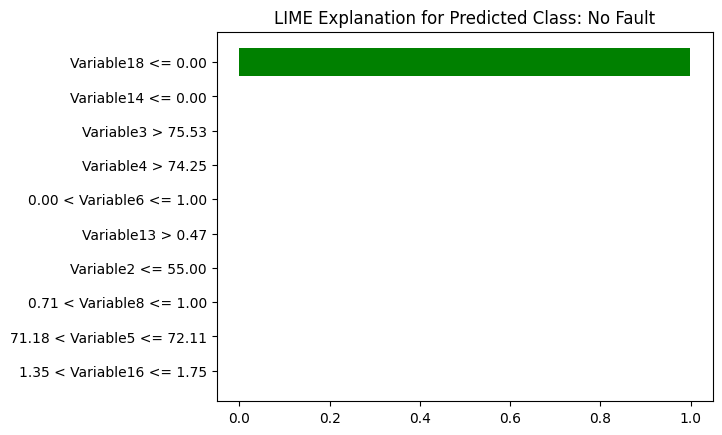
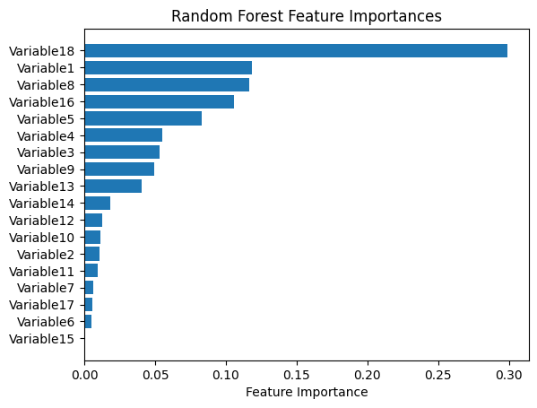
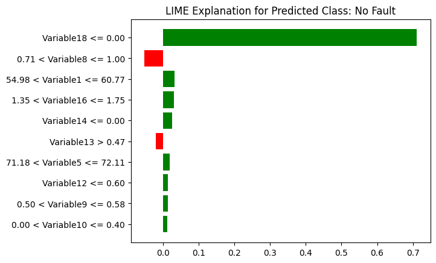
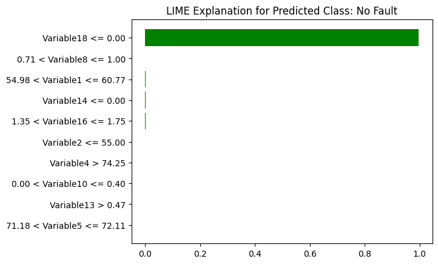
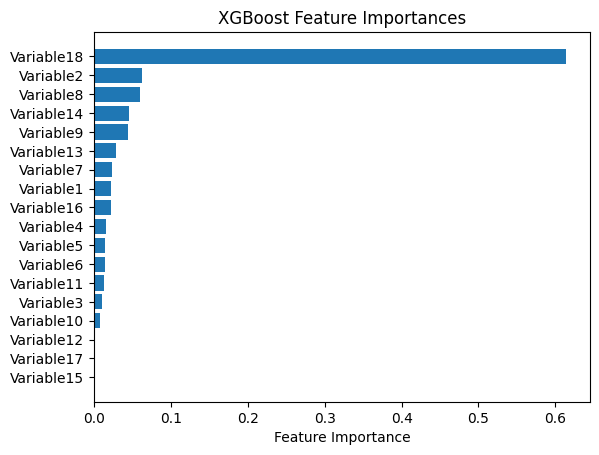
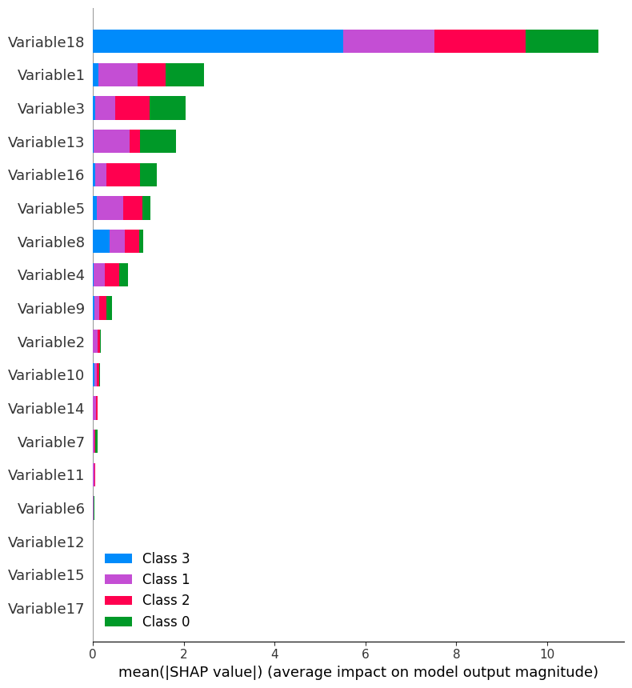

# Machine Learning Fault Classification System

## Project Overview
This project develops a multi-class machine learning system for fault type classification, implementing four advanced machine learning models to diagnose system faults with high accuracy and interpretability.

## Technical Approach
### Machine Learning Models
1. **Neural Network**
   - Implemented using Keras Sequential model
   - Architecture: 64-32-4 layer structure with dropout regularization
   - Softmax activation for multi-class classification



2. **Decision Tree Classifier**
   - Provides interpretable decision boundaries
   - Visualized using `dtreeviz` for enhanced understanding




3. **Random Forest Classifier**
   - Implemented with 100 estimators
   - Performed 5-fold stratified cross-validation
   - Comprehensive feature importance analysis





4. **XGBoost Classifier**
   - Utilized GridSearchCV for hyperparameter tuning
   - Explored parameter grid including:
     - Number of estimators
     - Max tree depth
     - Learning rate
     - Subsample and feature sampling ratios







## Key Techniques
- **Model Interpretability**:
  - LIME (Local Interpretable Model-agnostic Explanations)
  - SHAP (SHapley Additive exPlanations) for XGBoost
- **Cross-Validation**: Stratified K-Fold with 5 splits
- **Evaluation Metrics**: Accuracy, F1-Score, Classification Report

## Data Preprocessing
- Dataset loaded from 'dataset.csv'
- Datetime parsing
- Missing value and duplicate handling
- Feature scaling
- Label encoding
- Train-validation-test split (70-15-15)

## Prerequisites
### Libraries
- pandas
- numpy
- scikit-learn
- keras
- xgboost
- shap
- lime
- matplotlib
- dtreeviz

### Python Version
- Python 3.7+

## Installation
```bash
pip install pandas numpy scikit-learn keras xgboost shap lime matplotlib dtreeviz
```

## Project Structure
- Data preprocessing
- Model training
- Model evaluation
- Interpretability analysis
- Visualization of results

## Performance Highlights
- Comprehensive model comparison
- Detailed feature importance analysis
- Interpretable predictions using LIME and SHAP

## Visualization Techniques
- Decision tree visualization
- Feature importance plots
- SHAP summary plots
- LIME explanations for individual predictions
